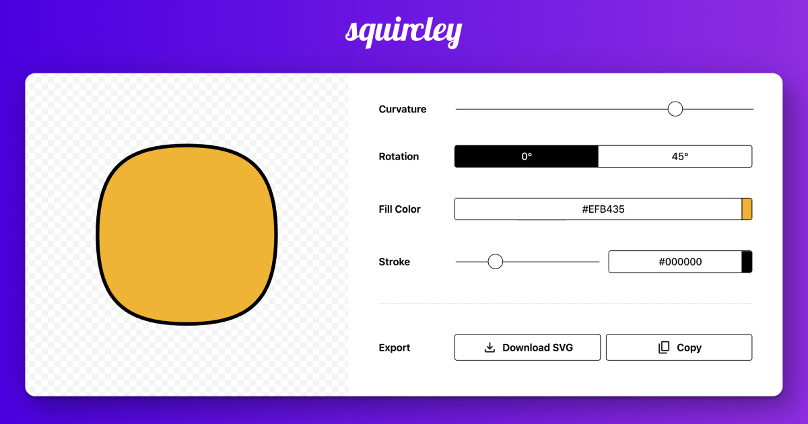

# Squircley 🟡

A modern, web-based SVG squircle generator that creates beautiful rounded square shapes with customizable curvature, colors, and rotation. Perfect for UI designers, developers, and anyone needing scalable vector graphics.



## ✨ Features

- **Real-time Shape Generation**: Create squircles with adjustable curvature using mathematical superellipse formulas
- **Color Customization**: Choose fill and stroke colors with an intuitive color picker
- **Rotation Support**: Rotate shapes by 0° or 45°
- **Responsive Design**: Works seamlessly across desktop and mobile devices
- **Export Options**: Download SVG files or copy SVG code to clipboard
- **Accessibility**: ARIA labels and keyboard navigation support
- **Performance Optimized**: Modular JavaScript architecture with ES6 modules

## 🚀 Live Demo

Visit [squircley.lol](https://squircley.lol) to try it out!

## 🛠️ Technologies Used

- **Frontend**: Vanilla JavaScript (ES6 Modules)
- **Styling**: CSS with SMACSS architecture
- **Color Picker**: Coloris library
- **Math**: Custom superellipse algorithms
- **Build**: No build process required - pure web standards

## 📁 Project Structure

```
squircley/
├── index.html              # Main HTML file
├── js/
│   ├── app.js             # Main application entry point
│   └── modules/           # Modular JavaScript architecture
│       ├── config.js      # Configuration and constants
│       ├── color-picker.js# Color picker functionality
│       ├── superellipse.js# Mathematical shape generation
│       ├── shape-manager.js# Shape update logic
│       ├── export-manager.js# SVG export functionality
│       └── animation.js   # Rotation animations
├── styles/
│   ├── reset.css          # CSS reset
│   ├── main.css          # Main styles (SMACSS architecture)
│   └── coloris.min.css   # Color picker styles
├── coloris.min.js         # Color picker library
├── CNAME                  # GitHub Pages domain
├── site.webmanifest       # PWA manifest
├── robots.txt             # SEO robots file
├── sitemap.xml            # SEO sitemap
├── og-image.png           # Social media preview
├── favicon.*              # Favicon files
├── android-chrome-*.png   # Android app icons
└── apple-touch-icon.png   # iOS app icon
```

## 🏃‍♂️ Quick Start

### Prerequisites

- A modern web browser (Chrome, Firefox, Safari, Edge)
- A local web server (optional but recommended)

### Installation

1. **Clone the repository:**

   ```bash
   git clone https://github.com/yourusername/squircley.git
   cd squircley
   ```

2. **Start a local server:**

   ```bash
   # Using Python (Python 3)
   python3 -m http.server 8000

   # Using Node.js (if you have http-server installed)
   npx http-server -p 8000

   # Or use any other local server
   ```

3. **Open in browser:**
   ```
   http://localhost:8000
   ```

That's it! No build process or dependencies required.

## 🎮 Usage

### Basic Controls

1. **Curvature Slider**: Adjust the roundness of corners (0 = sharp corners, 100 = very rounded)
2. **Rotation Buttons**: Choose between 0° or 45° rotation
3. **Fill Color**: Click the color button to choose fill color
4. **Stroke Settings**:
   - **Thickness Slider**: Adjust stroke width (0-16px)
   - **Stroke Color**: Choose stroke color
5. **Export Options**:
   - **Download SVG**: Download the generated shape as an SVG file
   - **Copy**: Copy SVG code to clipboard

### Keyboard Shortcuts

- `Tab`: Navigate between controls
- `Space/Enter`: Activate buttons and open color pickers
- `Escape`: Close color picker
- Arrow keys: Navigate color picker interface

## 🏗️ Architecture

### SMACSS CSS Organization

Following Scalable and Modular Architecture for CSS:

- **Base**: Reset styles, typography, form elements
- **Layout**: Page sections (`.l-stage`, `.l-preview`, `.l-controls`)
- **Module**: Reusable components (`.logo`, `.control-group`, `.button`)
- **State**: Dynamic states (`.is-dotted`, button states)
- **Responsive**: Mobile-specific overrides

### Modular JavaScript

The application uses ES6 modules for clean separation of concerns:

- **Configuration Management**: Centralized constants and settings
- **Single Responsibility**: Each module handles one specific aspect
- **Dependency Injection**: Clear import/export relationships
- **Testability**: Modules can be unit tested independently

## 🤝 Contributing

We welcome contributions! Here's how to get started:

### Development Setup

1. Fork the repository
2. Create a feature branch: `git checkout -b feature/your-feature`
3. Make your changes
4. Test thoroughly across different browsers
5. Commit with clear messages: `git commit -m "Add: new feature description"`
6. Push to your fork: `git push origin feature/your-feature`
7. Create a Pull Request

### Code Style

- Use ES6+ features and modern JavaScript practices
- Follow SMACSS conventions for CSS
- Include JSDoc comments for functions
- Test across Chrome, Firefox, Safari, and Edge
- Ensure accessibility compliance

### Reporting Issues

- Use the GitHub Issues template
- Include browser version and OS
- Provide steps to reproduce
- Include screenshots if applicable

## 📱 Progressive Web App (PWA)

Squircley is a PWA and can be installed on supported devices:

- **Android**: Chrome menu → "Add to Home screen"
- **iOS**: Safari share button → "Add to Home Screen"
- **Desktop**: Chrome/Edge address bar → "Install Squircley"

## 🔍 Browser Support

- **Chrome**: 70+
- **Firefox**: 65+
- **Safari**: 12+
- **Edge**: 79+

## 📄 License

This project is licensed under the MIT License - see the [LICENSE](LICENSE) file for details.

## 🙏 Acknowledgments

- **Coloris**: Modern color picker library
- **Superellipse Mathematics**: Based on the mathematical concept by Piet Hein
- **SMACSS**: CSS architecture methodology
- **Open Source Community**: For the tools and inspiration

## 📞 Contact

- **Website**: [squircley.lol](https://squircley.lol)
- **Issues**: [GitHub Issues](https://github.com/yourusername/squircley/issues)
- **Discussions**: [GitHub Discussions](https://github.com/yourusername/squircley/discussions)

---

**Made with ❤️ for designers and developers who love clean, scalable graphics.**
